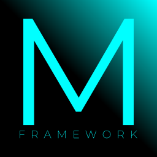

# The mpax235 Framework
The mpax235 Framework is a JavaScript framework that tends to make coding more easier.

## Hello World Program Example
`function helloworld() {` 
&nbsp;&nbsp;&nbsp;&nbsp;&nbsp;&nbsp;&nbsp;&nbsp;`mpaxfw.log('Hello World!');` 
`}`  
`helloworld();`

## Documentation
Documentation is at https://mpax235.github.io/mpax235-framework/index.html.

## Made in
Framework: 
 
Website: 

